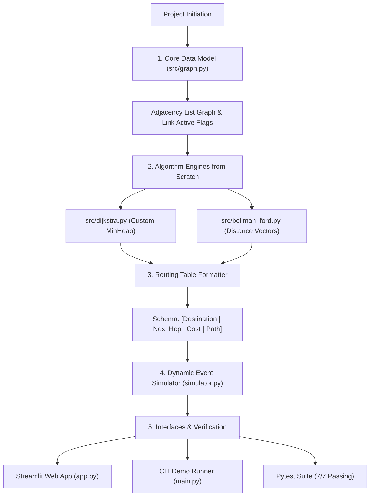
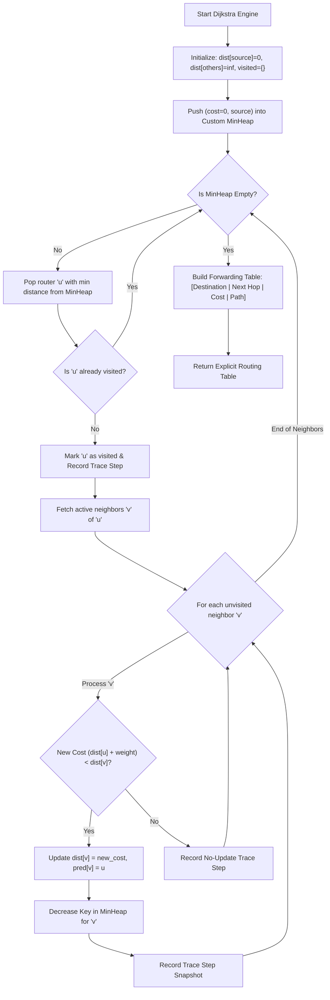
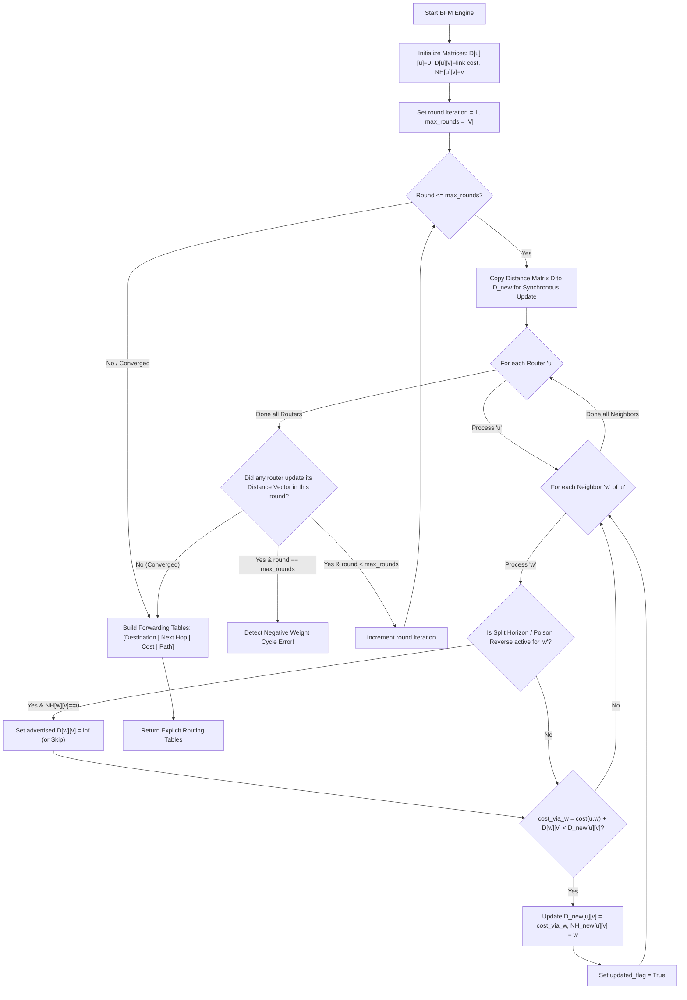

# Network Shortest Path Simulator - Project Flowcharts

This document contains 3 comprehensive flowcharts visualizing:
1. **Project Development & Architecture Procedure**
2. **Dijkstra's Link-State Algorithm Execution Flow**
3. **Bellman-Ford-Moore (BFM) Distance-Vector Algorithm Execution Flow**

---

## 1. Project Development Procedure Flowchart

Visualization of how the project components were designed, integrated, and verified from scratch.

---

## 2. Dijkstra's Algorithm (Link-State / OSPF) Execution Flowchart

Visualization of how the Dijkstra engine calculates shortest paths using a custom Binary Min-Heap Priority Queue and builds explicit routing tables.

---

## 3. Bellman-Ford-Moore (BFM) Distance-Vector Execution Flowchart

Visualization of how the Bellman-Ford engine computes distance vectors round-by-round across routers, supporting Split Horizon and Poison Reverse.

